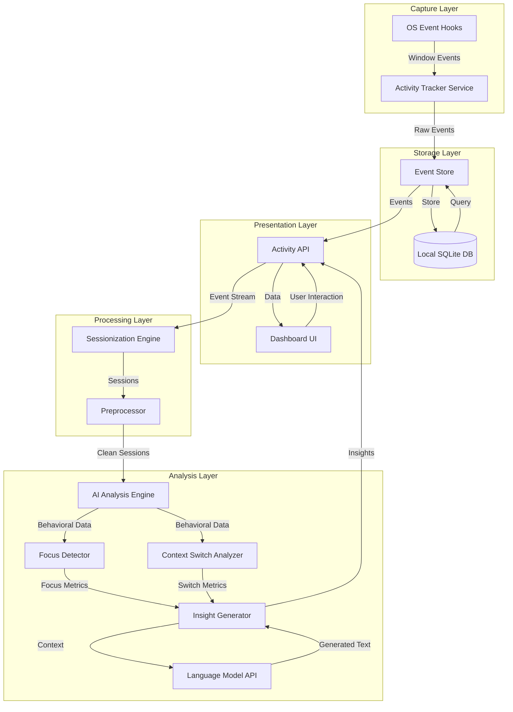
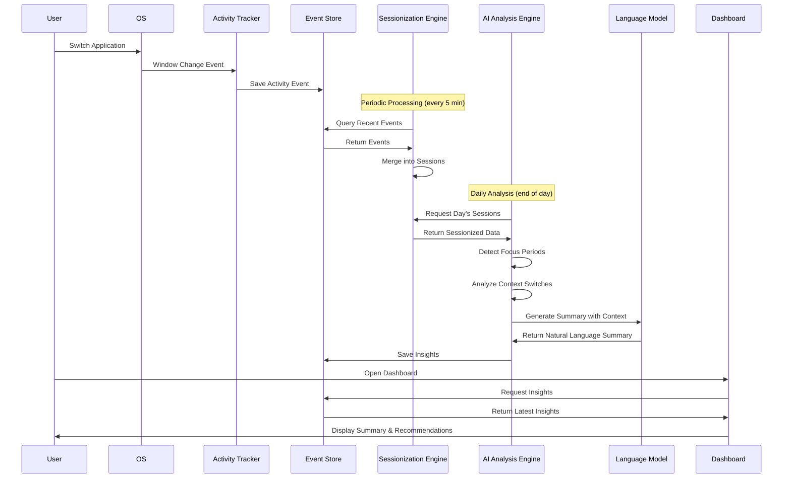

# Design Document: Behavioral Intelligence System

## Overview

The Behavioral Intelligence System is a privacy-first, AI-powered activity tracking and analysis platform that automatically captures user behavior, processes it into meaningful insights, and provides actionable recommendations for workflow optimization. The system operates entirely locally on the user's device, ensuring complete data privacy while delivering sophisticated behavioral analysis.

The architecture follows a modular, pipeline-based design with five primary layers:

1. **Capture Layer**: Background activity tracking service that monitors application usage, window titles, and idle states
2. **Storage Layer**: Local encrypted database for persisting raw activity events
3. **Processing Layer**: Sessionization and preprocessing engine that transforms raw events into meaningful work sessions
4. **Analysis Layer**: AI-powered engine that detects patterns, generates insights, and creates recommendations
5. **Presentation Layer**: Dashboard and API interfaces for accessing insights and data

The system is designed to be extensible, allowing new data sources, analysis algorithms, and output formats to be added without modifying core components. All inter-component communication occurs through well-defined APIs, enabling independent development, testing, and deployment of each module.

## Architecture

### High-Level Architecture Diagram



### Component Interaction Flow



## Components and Interfaces

### 1. Activity Tracker Service

**Purpose**: Continuously monitor user activity and capture application usage, window titles, timestamps, and idle states.

**Technology**: Platform-specific native service (Windows Service, macOS LaunchDaemon, Linux systemd service)

**Key Responsibilities**:
- Hook into OS-level window management events
- Detect active application and window title changes
- Monitor user idle state using input device activity
- Batch and buffer events before writing to storage
- Handle system sleep/wake events gracefully

**Interface**:
```typescript
interface ActivityTracker {
  start(): Promise<void>
  stop(): Promise<void>
  pause(): void
  resume(): void
  configure(config: TrackerConfig): void
  getStatus(): TrackerStatus
}

interface TrackerConfig {
  excludedApps: string[]
  excludedWindowPatterns: RegExp[]
  idleThresholdSeconds: number
  samplingIntervalMs: number
}

interface TrackerStatus {
  isRunning: boolean
  isPaused: boolean
  eventsBuffered: number
  lastEventTime: Date
}
```

**Implementation Details**:
- **Windows**: Use `SetWinEventHook` API to monitor `EVENT_SYSTEM_FOREGROUND` events
- **macOS**: Use `NSWorkspace` notifications and Accessibility API for window titles
- **Linux**: Use X11 `XGetInputFocus` or Wayland compositor protocols

**Event Buffering**: Buffer events in memory (max 100 events or 30 seconds) before batch writing to reduce disk I/O

**Idle Detection**: Monitor keyboard and mouse events; mark as idle after configurable threshold (default 60 seconds)

### 2. Event Store

**Purpose**: Persist activity events to local storage with encryption, efficient querying, and automatic retention management.

**Technology**: SQLite database with SQLCipher extension for encryption

**Schema**:
```sql
CREATE TABLE activity_events (
  id INTEGER PRIMARY KEY AUTOINCREMENT,
  timestamp_utc TEXT NOT NULL,
  application_name TEXT NOT NULL,
  window_title TEXT NOT NULL,
  process_id INTEGER,
  duration_seconds INTEGER,
  is_idle BOOLEAN DEFAULT 0,
  created_at TEXT DEFAULT CURRENT_TIMESTAMP,
  INDEX idx_timestamp (timestamp_utc),
  INDEX idx_app (application_name),
  INDEX idx_created (created_at)
);

CREATE TABLE sessions (
  id INTEGER PRIMARY KEY AUTOINCREMENT,
  start_time TEXT NOT NULL,
  end_time TEXT NOT NULL,
  application_name TEXT NOT NULL,
  window_title TEXT NOT NULL,
  total_duration_seconds INTEGER,
  event_count INTEGER,
  context_category TEXT,
  INDEX idx_start_time (start_time)
);

CREATE TABLE insights (
  id INTEGER PRIMARY KEY AUTOINCREMENT,
  generated_at TEXT NOT NULL,
  period_start TEXT NOT NULL,
  period_end TEXT NOT NULL,
  insight_type TEXT NOT NULL, -- 'daily', 'weekly'
  summary_text TEXT NOT NULL,
  metrics_json TEXT NOT NULL,
  recommendations_json TEXT NOT NULL,
  INDEX idx_generated (generated_at),
  INDEX idx_type (insight_type)
);

CREATE TABLE config (
  key TEXT PRIMARY KEY,
  value TEXT NOT NULL,
  updated_at TEXT DEFAULT CURRENT_TIMESTAMP
);
```

**Interface**:
```typescript
interface EventStore {
  // Event operations
  insertEvent(event: ActivityEvent): Promise<void>
  insertEvents(events: ActivityEvent[]): Promise<void>
  queryEvents(filter: EventFilter): Promise<ActivityEvent[]>
  deleteEventsBefore(date: Date): Promise<number>
  
  // Session operations
  insertSession(session: WorkSession): Promise<void>
  querySessions(filter: SessionFilter): Promise<WorkSession[]>
  
  // Insight operations
  insertInsight(insight: Insight): Promise<void>
  queryInsights(filter: InsightFilter): Promise<Insight[]>
  
  // Configuration
  getConfig(key: string): Promise<string | null>
  setConfig(key: string, value: string): Promise<void>
  
  // Maintenance
  vacuum(): Promise<void>
  getStorageSize(): Promise<number>
}

interface ActivityEvent {
  id?: number
  timestampUtc: Date
  applicationName: string
  windowTitle: string
  processId: number
  durationSeconds: number
  isIdle: boolean
}

interface EventFilter {
  startTime?: Date
  endTime?: Date
  applicationName?: string
  excludeIdle?: boolean
  limit?: number
  offset?: number
}
```

**Data Retention**: Automatically delete events older than configured threshold (default 90 days) using scheduled cleanup job

**Encryption**: Use SQLCipher with AES-256 encryption; encryption key derived from system-specific identifier and stored in OS keychain

### 3. Activity API

**Purpose**: Provide RESTful HTTP interface for querying activity data, sessions, and insights.

**Technology**: Lightweight HTTP server (Express.js or FastAPI) running on localhost

**Endpoints**:
```
GET  /api/events
  Query parameters: start_time, end_time, app_name, exclude_idle, limit, offset
  Returns: { events: ActivityEvent[], total: number, page: number }

GET  /api/events/export
  Query parameters: start_time, end_time, format (csv|json)
  Returns: File download

GET  /api/sessions
  Query parameters: start_time, end_time, limit, offset
  Returns: { sessions: WorkSession[], total: number }

GET  /api/insights
  Query parameters: type (daily|weekly), start_date, end_date
  Returns: { insights: Insight[] }

GET  /api/insights/latest
  Returns: { insight: Insight }

POST /api/tracker/pause
  Returns: { status: "paused" }

POST /api/tracker/resume
  Returns: { status: "running" }

GET  /api/tracker/status
  Returns: TrackerStatus

PUT  /api/config
  Body: { key: string, value: string }
  Returns: { success: boolean }

GET  /api/config/:key
  Returns: { key: string, value: string }
```

**Security**: 
- API only accessible on localhost (127.0.0.1)
- Generate random API token on first run, stored in config
- All requests must include `Authorization: Bearer <token>` header
- CORS disabled to prevent browser-based access from external origins

**Rate Limiting**: Implement basic rate limiting (100 requests per minute) to prevent accidental resource exhaustion

### 4. Sessionization Engine

**Purpose**: Transform raw activity events into meaningful work sessions by merging related events and filtering noise.

**Processing Logic**:

1. **Event Grouping**: Group consecutive events by application and window title
2. **Idle Handling**: Split sessions when idle period exceeds threshold (default 5 minutes)
3. **Context Detection**: Identify context switches based on application domain changes
4. **Noise Filtering**: Remove events with duration < 10 seconds
5. **Session Merging**: Merge events in same context within time threshold

**Algorithm**:
```
function sessionize(events: ActivityEvent[]): WorkSession[] {
  sessions = []
  currentSession = null
  
  for event in events:
    if event.isIdle and event.durationSeconds > IDLE_THRESHOLD:
      if currentSession:
        sessions.push(currentSession)
        currentSession = null
      continue
    
    if event.durationSeconds < NOISE_THRESHOLD:
      continue
    
    if currentSession == null:
      currentSession = createSession(event)
    else if canMerge(currentSession, event):
      mergeIntoSession(currentSession, event)
    else:
      sessions.push(currentSession)
      currentSession = createSession(event)
  
  if currentSession:
    sessions.push(currentSession)
  
  return sessions
}

function canMerge(session: WorkSession, event: ActivityEvent): boolean {
  return session.applicationName == event.applicationName
    and session.windowTitle == event.windowTitle
    and (event.timestampUtc - session.endTime) < MERGE_THRESHOLD
}
```

**Interface**:
```typescript
interface SessionizationEngine {
  processEvents(events: ActivityEvent[]): Promise<WorkSession[]>
  processTimeRange(startTime: Date, endTime: Date): Promise<WorkSession[]>
  configure(config: SessionConfig): void
}

interface SessionConfig {
  idleThresholdSeconds: number  // default: 300 (5 min)
  noiseThresholdSeconds: number  // default: 10
  mergeThresholdSeconds: number  // default: 30
}

interface WorkSession {
  id?: number
  startTime: Date
  endTime: Date
  applicationName: string
  windowTitle: string
  totalDurationSeconds: number
  eventCount: number
  contextCategory: string
}
```

**Context Categories**: Classify applications into categories for better analysis:
- `communication`: Email, Slack, Teams, Zoom
- `development`: IDEs, terminals, Git clients
- `documentation`: Word, Google Docs, Notion
- `browsing`: Web browsers
- `design`: Figma, Photoshop, Sketch
- `other`: Uncategorized applications

### 5. AI Analysis Engine

**Purpose**: Analyze sessionized data to detect behavioral patterns, calculate metrics, and generate insights.

**Sub-Components**:

#### 5.1 Focus Detector

**Algorithm**:
```
function detectFocusPeriods(sessions: WorkSession[]): FocusPeriod[] {
  focusPeriods = []
  
  for session in sessions:
    if session.totalDurationSeconds >= FOCUS_THRESHOLD_SECONDS:
      contextSwitches = countContextSwitches(session)
      if contextSwitches <= MAX_SWITCHES_IN_FOCUS:
        focusPeriods.push({
          startTime: session.startTime,
          endTime: session.endTime,
          durationMinutes: session.totalDurationSeconds / 60,
          application: session.applicationName,
          context: session.contextCategory
        })
  
  return focusPeriods
}

FOCUS_THRESHOLD_SECONDS = 25 * 60  // 25 minutes
MAX_SWITCHES_IN_FOCUS = 2
```

**Metrics Calculated**:
- Total focus time per day
- Percentage of active time in focus
- Average focus session duration
- Time of day with most focus
- Applications associated with focus

#### 5.2 Context Switch Analyzer

**Algorithm**:
```
function analyzeContextSwitches(sessions: WorkSession[]): ContextSwitchMetrics {
  switches = []
  
  for i in range(1, sessions.length):
    prevSession = sessions[i-1]
    currSession = sessions[i]
    
    if prevSession.contextCategory != currSession.contextCategory:
      switches.push({
        fromContext: prevSession.contextCategory,
        toContext: currSession.contextCategory,
        fromApp: prevSession.applicationName,
        toApp: currSession.applicationName,
        timestamp: currSession.startTime,
        timeSinceLastSwitch: currSession.startTime - prevSession.endTime
      })
  
  return {
    totalSwitches: switches.length,
    switchesPerHour: calculateSwitchesPerHour(switches),
    mostCommonPatterns: findCommonPatterns(switches),
    averageTimeInContext: calculateAverageTimeInContext(sessions),
    fragmentationScore: calculateFragmentation(switches)
  }
}

function calculateFragmentation(switches: ContextSwitch[]): number {
  // High fragmentation = many switches with short time between them
  if switches.length == 0:
    return 0
  
  avgTimeBetweenSwitches = average(switches.map(s => s.timeSinceLastSwitch))
  
  // Normalize: 0 = low fragmentation, 100 = high fragmentation
  // Assume < 5 min between switches = high fragmentation
  return min(100, (5 * 60 / avgTimeBetweenSwitches) * 100)
}
```

**Metrics Calculated**:
- Context switches per hour/day/week
- Most common switch patterns (e.g., email → doc → chat)
- Fragmentation score (0-100)
- Average time in each context before switching
- Applications causing most switches

#### 5.3 Insight Generator

**Purpose**: Generate natural language summaries and recommendations using AI language models.

**Process**:
1. Collect metrics from Focus Detector and Context Switch Analyzer
2. Format metrics into structured context for LLM
3. Send context to language model with appropriate prompt
4. Parse and validate LLM response
5. Store generated insights

**LLM Integration**:
```typescript
interface InsightGenerator {
  generateDailySummary(date: Date): Promise<Insight>
  generateWeeklySummary(weekStart: Date): Promise<Insight>
  generateRecommendations(metrics: BehavioralMetrics): Promise<Recommendation[]>
}

interface LLMProvider {
  generateText(prompt: string, context: any): Promise<string>
  configure(config: LLMConfig): void
}

interface LLMConfig {
  provider: 'openai' | 'anthropic' | 'local'
  apiKey?: string
  model: string
  maxTokens: number
  temperature: number
}
```

**Prompt Template for Daily Summary**:
```
You are an AI assistant analyzing a user's work behavior. Generate a concise, actionable daily summary.

Context:
- Date: {date}
- Total active time: {activeTime} hours
- Focus time: {focusTime} hours ({focusPercentage}% of active time)
- Focus sessions: {focusSessionCount}
- Context switches: {contextSwitches} ({switchesPerHour} per hour)
- Fragmentation score: {fragmentationScore}/100
- Top applications: {topApps}
- Most productive time: {peakFocusTime}

Previous day comparison:
- Focus time change: {focusTimeDelta}
- Context switches change: {switchesDelta}

Generate a 3-4 sentence summary in plain language that:
1. Highlights the most important pattern or achievement
2. Notes any significant changes from previous days
3. Is specific and uses actual data from the context
4. Is encouraging and constructive

Then provide 2-3 specific, actionable recommendations based on the data.
```

**Fallback Template** (when LLM unavailable):
```
Daily Summary for {date}:

You were active for {activeTime} hours today. You achieved {focusTime} hours of focused work ({focusPercentage}% of your active time) across {focusSessionCount} focus sessions. You switched contexts {contextSwitches} times ({switchesPerHour} per hour).

{comparison_text}

Your most productive time was {peakFocusTime}.

Recommendations:
{template_recommendations}
```

**Recommendation Logic**:
```
function generateRecommendations(metrics: BehavioralMetrics): Recommendation[] {
  recommendations = []
  
  // High context switching
  if metrics.switchesPerHour > 20:
    recommendations.push({
      type: 'reduce_switching',
      priority: 'high',
      text: 'Your context switching is high ({switchesPerHour} per hour). Try time-blocking: dedicate specific hours to specific types of work.',
      actionable: 'Block 9-11 AM for deep work and disable notifications during this time.'
    })
  
  // Low focus time
  if metrics.focusPercentage < 30:
    recommendations.push({
      type: 'increase_focus',
      priority: 'high',
      text: 'Only {focusPercentage}% of your time was spent in focus. Your peak focus time is {peakFocusTime}.',
      actionable: 'Schedule your most important work during {peakFocusTime} when you naturally focus best.'
    })
  
  // High fragmentation
  if metrics.fragmentationScore > 70:
    recommendations.push({
      type: 'reduce_fragmentation',
      priority: 'medium',
      text: 'Your work is highly fragmented with frequent short switches.',
      actionable: 'Batch similar tasks together (e.g., check email only at 10 AM, 2 PM, and 4 PM).'
    })
  
  // Positive reinforcement
  if metrics.focusPercentage > 50:
    recommendations.push({
      type: 'maintain',
      priority: 'low',
      text: 'Great focus today! You spent {focusPercentage}% of your time in deep work.',
      actionable: 'Keep protecting your focus time from interruptions.'
    })
  
  return recommendations.slice(0, 3)  // Max 3 recommendations
}
```

**Interface**:
```typescript
interface AIAnalysisEngine {
  analyzePeriod(startTime: Date, endTime: Date): Promise<BehavioralMetrics>
  generateInsight(metrics: BehavioralMetrics, type: InsightType): Promise<Insight>
  configure(config: AnalysisConfig): void
}

interface BehavioralMetrics {
  period: { start: Date, end: Date }
  activeTimeSeconds: number
  focusTimeSeconds: number
  focusPercentage: number
  focusSessions: FocusPeriod[]
  contextSwitches: ContextSwitch[]
  switchesPerHour: number
  fragmentationScore: number
  topApplications: ApplicationUsage[]
  peakFocusTime: string
  comparisonToPrevious?: MetricsComparison
}

interface Insight {
  id?: number
  generatedAt: Date
  periodStart: Date
  periodEnd: Date
  insightType: 'daily' | 'weekly'
  summaryText: string
  metrics: BehavioralMetrics
  recommendations: Recommendation[]
}

interface Recommendation {
  type: string
  priority: 'high' | 'medium' | 'low'
  text: string
  actionable: string
}
```

### 6. Dashboard UI

**Purpose**: Provide visual interface for viewing insights, metrics, and activity timelines.

**Technology**: Web-based UI (React or Vue.js) served by Activity API, accessible via browser at `http://localhost:8080`

**Views**:

#### 6.1 Today View (Default)
- Timeline visualization of today's activity (horizontal bar chart by hour)
- Current focus time and context switches
- Latest AI-generated summary
- Top 3 recommendations
- Quick stats: active time, focus %, switches/hour

#### 6.2 Trends View
- Focus time trend chart (7 days and 30 days)
- Context switching frequency chart
- Application usage breakdown (pie chart)
- Week-over-week comparison

#### 6.3 Insights View
- Historical summaries (daily and weekly)
- Searchable and filterable
- Export individual insights

#### 6.4 Settings View
- Tracker controls (pause/resume)
- Excluded applications list
- Excluded window patterns
- Data retention settings
- LLM provider configuration
- Export data options

**UI Components**:
```typescript
interface DashboardState {
  currentInsight: Insight | null
  todayMetrics: BehavioralMetrics | null
  trackerStatus: TrackerStatus
  trends: TrendData
  settings: UserSettings
}

interface TrendData {
  focusTimeSeries: DataPoint[]
  switchesSeries: DataPoint[]
  applicationUsage: ApplicationUsage[]
}

interface DataPoint {
  date: Date
  value: number
}

interface ApplicationUsage {
  applicationName: string
  totalSeconds: number
  percentage: number
}
```

**Real-time Updates**: Dashboard polls Activity API every 60 seconds for updated metrics and insights

## Data Models

### Core Data Structures

```typescript
// Raw activity event from tracker
interface ActivityEvent {
  id?: number
  timestampUtc: Date
  applicationName: string
  windowTitle: string
  processId: number
  durationSeconds: number
  isIdle: boolean
}

// Sessionized work period
interface WorkSession {
  id?: number
  startTime: Date
  endTime: Date
  applicationName: string
  windowTitle: string
  totalDurationSeconds: number
  eventCount: number
  contextCategory: 'communication' | 'development' | 'documentation' | 'browsing' | 'design' | 'other'
}

// Detected focus period
interface FocusPeriod {
  startTime: Date
  endTime: Date
  durationMinutes: number
  application: string
  context: string
  interruptionCount: number
}

// Context switch event
interface ContextSwitch {
  fromContext: string
  toContext: string
  fromApp: string
  toApp: string
  timestamp: Date
  timeSinceLastSwitch: number
}

// Generated insight
interface Insight {
  id?: number
  generatedAt: Date
  periodStart: Date
  periodEnd: Date
  insightType: 'daily' | 'weekly'
  summaryText: string
  metrics: BehavioralMetrics
  recommendations: Recommendation[]
}

// Behavioral metrics
interface BehavioralMetrics {
  period: { start: Date, end: Date }
  activeTimeSeconds: number
  focusTimeSeconds: number
  focusPercentage: number
  focusSessions: FocusPeriod[]
  contextSwitches: ContextSwitch[]
  switchesPerHour: number
  fragmentationScore: number
  topApplications: ApplicationUsage[]
  peakFocusTime: string
  comparisonToPrevious?: MetricsComparison
}

// Metrics comparison
interface MetricsComparison {
  focusTimeDelta: number  // seconds
  focusPercentageDelta: number  // percentage points
  switchesDelta: number
  fragmentationDelta: number
}

// Recommendation
interface Recommendation {
  type: string
  priority: 'high' | 'medium' | 'low'
  text: string
  actionable: string
}
```

### Data Flow

```
Raw Events → Sessionization → Behavioral Analysis → Insight Generation → User Presentation

ActivityEvent[] 
  → WorkSession[] 
  → BehavioralMetrics 
  → Insight 
  → Dashboard Display
```

## Correctness Properties

*A property is a characteristic or behavior that should hold true across all valid executions of a system—essentially, a formal statement about what the system should do. Properties serve as the bridge between human-readable specifications and machine-verifiable correctness guarantees.*


### Property 1: Event Data Completeness

*For any* activity event generated by the Activity_Tracker, the event must contain all required fields: application name, window title, timestamp in UTC with millisecond precision, process identifier, duration, and idle state flag.

**Validates: Requirements 2.1, 2.3, 2.4**

### Property 2: Event Duration Calculation

*For any* activity event with a start time and end time, the recorded duration must equal the difference between end time and start time.

**Validates: Requirements 2.2**

### Property 3: Window Distinction

*For any* two activity events with the same application name but different active windows, the events must have different window titles to distinguish them.

**Validates: Requirements 2.5**

### Property 4: Rapid Switch Capture

*For any* sequence of application switches, each distinct switch must generate a separate activity event in the Event_Store.

**Validates: Requirements 2.6**

### Property 5: Data Persistence Round Trip

*For any* activity event written to the Event_Store, reading it back must return an equivalent event with all fields preserved, and sessionized data must not modify or delete the original raw events.

**Validates: Requirements 3.1, 5.6**

### Property 6: Data Retention Policy

*For any* activity event older than the configured retention threshold, the event must be deleted by the automatic retention policy.

**Validates: Requirements 3.5**

### Property 7: API Filter Correctness

*For any* query to the Activity_API with time range or application name filters, all returned events must match the filter criteria (fall within the time range or match the application name).

**Validates: Requirements 4.1, 4.2, 16.4**

### Property 8: API Result Ordering

*For any* query result from the Activity_API, the returned events must be ordered chronologically by timestamp in ascending order.

**Validates: Requirements 4.3**

### Property 9: API Response Completeness

*For any* activity event returned by the Activity_API, the event must be valid JSON containing all captured fields.

**Validates: Requirements 4.4**

### Property 10: API Error Handling

*For any* invalid query parameters provided to the Activity_API, the API must return an error response with a descriptive message and appropriate HTTP status code.

**Validates: Requirements 4.5**

### Property 11: API Pagination Correctness

*For any* paginated query result, the pages must not overlap, and the union of all pages must contain exactly the complete result set.

**Validates: Requirements 4.6**

### Property 12: Session Merging

*For any* sequence of consecutive activity events with the same application name and window title, where events are separated by less than the merge threshold, the Sessionization_Engine must merge them into a single work session.

**Validates: Requirements 5.1**

### Property 13: Idle Separation

*For any* two activity events separated by idle time exceeding the idle threshold (5 minutes), the Sessionization_Engine must place them in separate work sessions.

**Validates: Requirements 5.2**

### Property 14: Context Switch Separation

*For any* two consecutive activity events with different context categories, the Sessionization_Engine must create separate work sessions.

**Validates: Requirements 5.3**

### Property 15: Noise Filtering

*For any* sessionized output from the Sessionization_Engine, no events with duration less than the noise threshold (10 seconds) must be included.

**Validates: Requirements 5.4**

### Property 16: Session Metrics Calculation

*For any* time period analyzed by the Sessionization_Engine, the calculated total active time must equal the sum of all session durations, the context switch count must equal the number of context category changes, and the average session duration must equal total active time divided by session count.

**Validates: Requirements 5.5**

### Property 17: Focus Period Criteria

*For any* work session identified as a focus period by the AI_Analysis_Engine, the session must have duration exceeding 25 minutes and contain fewer than 2 context switches.

**Validates: Requirements 6.1**

### Property 18: Focus Percentage Calculation

*For any* daily analysis by the AI_Analysis_Engine, the focus percentage must equal (total focus time / total active time) × 100.

**Validates: Requirements 6.2**

### Property 19: Peak Focus Time Detection

*For any* detected peak focus time by the AI_Analysis_Engine, that time period must actually contain the highest frequency of focus periods in the analyzed data.

**Validates: Requirements 6.3**

### Property 20: Focus Period Application Association

*For any* focus period with associated applications, those applications must actually be used during that focus period according to the session data.

**Validates: Requirements 6.4**

### Property 21: Focus Interruption Recording

*For any* focus period that is interrupted, the AI_Analysis_Engine must record the interruption source (application or event that caused the interruption) and the interruption duration.

**Validates: Requirements 6.5**

### Property 22: Context Switch Counting

*For any* time period analyzed by the AI_Analysis_Engine, the counted context switches per hour/day/week must equal the actual number of context category changes in that period.

**Validates: Requirements 7.1**

### Property 23: Context Switch Pattern Identification

*For any* context switch pattern identified as "most common" by the AI_Analysis_Engine, that pattern must actually occur in the data with frequency greater than or equal to all other patterns.

**Validates: Requirements 7.2**

### Property 24: Average Context Duration Calculation

*For any* context category, the calculated average time spent in that context must equal the sum of all session durations in that context divided by the number of sessions in that context.

**Validates: Requirements 7.4**

### Property 25: Frequent Switch Application Identification

*For any* application identified as "most frequently causing context switches", that application must actually appear in more context switch events than any other application.

**Validates: Requirements 7.5**

### Property 26: Weekly Summary Comparison Data

*For any* weekly summary generated by the Insight_Generator, the summary must include comparison metrics from the previous week's data.

**Validates: Requirements 8.2**

### Property 27: Insight Example Verification

*For any* specific example included in an insight summary, that example must actually exist in the user's activity data for the analyzed period.

**Validates: Requirements 8.5**

### Property 28: Deep Work Recommendation Basis

*For any* recommended time for deep work, the recommendation must be based on actual historical focus periods occurring at that time.

**Validates: Requirements 9.2**

### Property 29: Recommendation Data Grounding

*For any* recommendation provided by the AI_Analysis_Engine, the recommendation must reference or be derived from actual behavioral data in the analyzed period.

**Validates: Requirements 9.4**

### Property 30: Recommendation Limit

*For any* insight summary, the number of recommendations must not exceed 3.

**Validates: Requirements 9.5**

### Property 31: Dashboard Data Accuracy

*For any* data displayed on the Dashboard (focus time trends, context switching frequency, top applications), the displayed values must match the actual calculated values from the underlying data.

**Validates: Requirements 10.2, 10.3, 10.4**

### Property 32: Insight Availability

*For any* summary generated by the Insight_Generator, the summary must be retrievable through the Activity_API immediately after generation.

**Validates: Requirements 11.3**

### Property 33: Trend Comparison Calculation

*For any* trend comparison in a summary (e.g., "20% more focus time"), the percentage must be correctly calculated as ((current - previous) / previous) × 100.

**Validates: Requirements 11.4**

### Property 34: Historical Summary Retention

*For any* summary less than 90 days old, the summary must still be stored and retrievable from the Event_Store.

**Validates: Requirements 11.5**

### Property 35: Application Exclusion

*For any* application in the exclusion list, no activity events must be generated or stored for that application.

**Validates: Requirements 12.1**

### Property 36: Window Pattern Exclusion

*For any* window title matching an excluded pattern, no activity events must be generated or stored for that window.

**Validates: Requirements 12.2**

### Property 37: Tracking Pause

*For any* time period when tracking is paused, no new activity events must be generated or stored.

**Validates: Requirements 12.3**

### Property 38: Data Deletion Completeness

*For any* user-requested data deletion, all activity events, sessions, and insights must be removed from the Event_Store.

**Validates: Requirements 12.4**

### Property 39: Privacy Data Exclusion

*For any* activity event captured by the Activity_Tracker, the event must not contain window content, keystrokes, or screenshots.

**Validates: Requirements 12.6**

### Property 40: LLM Context Completeness

*For any* call to the language model API, the provided context must include all required structured behavioral data (active time, focus time, context switches, top applications, etc.).

**Validates: Requirements 15.2**

### Property 41: Export Format Validity

*For any* data export from the Activity_API, the exported data must be valid in the requested format (valid CSV, valid JSON, or valid Markdown) and contain all requested events or summaries.

**Validates: Requirements 16.1, 16.2, 16.3**

### Property 42: Export Metadata Presence

*For any* data export, the export must include metadata indicating the export date and the data range covered.

**Validates: Requirements 16.5**

## Error Handling

### Error Categories

The system must handle errors gracefully across all components:

#### 1. Capture Layer Errors

**OS Event Hook Failures**:
- If OS event hooks fail to initialize, log error and retry with exponential backoff (max 5 attempts)
- If hooks fail during operation, attempt to re-establish hooks
- If re-establishment fails, notify user via system notification and pause tracking

**Permission Errors**:
- If accessibility permissions are denied (macOS/Linux), display clear instructions for granting permissions
- If permissions are revoked during operation, pause tracking and notify user

**Buffer Overflow**:
- If event buffer exceeds capacity, flush immediately to storage
- If flush fails, drop oldest events and log warning

#### 2. Storage Layer Errors

**Database Corruption**:
- If database file is corrupted, attempt automatic repair using SQLite recovery tools
- If repair fails, create new database and notify user of data loss
- Maintain backup of last 7 days of data for recovery

**Disk Space Exhaustion**:
- If disk space is insufficient, trigger immediate retention cleanup
- If cleanup insufficient, pause tracking and notify user
- Resume automatically when space available

**Encryption Key Loss**:
- If encryption key cannot be retrieved from keychain, prompt user for recovery
- If recovery fails, offer to create new database (data loss)

**Query Timeouts**:
- If query exceeds timeout (5 seconds), cancel query and return error
- Log slow queries for optimization

#### 3. Processing Layer Errors

**Invalid Event Data**:
- If event data is malformed, log error and skip event
- Continue processing remaining events
- Track error rate; if exceeds 10%, alert user

**Sessionization Failures**:
- If sessionization algorithm fails, fall back to simple time-based grouping
- Log error for debugging

#### 4. Analysis Layer Errors

**LLM API Failures**:
- If LLM API is unreachable, retry with exponential backoff (3 attempts)
- If all retries fail, fall back to template-based summary generation
- Cache last successful LLM response for comparison

**LLM Rate Limiting**:
- If rate limited, queue request and retry after rate limit window
- If queue exceeds capacity, use template-based summary

**Invalid LLM Response**:
- If LLM returns malformed response, attempt to parse and extract usable content
- If parsing fails, fall back to template-based summary
- Log invalid responses for debugging

**Insufficient Data**:
- If insufficient data for analysis (< 1 hour of activity), generate minimal summary
- Indicate data insufficiency in summary

#### 5. Presentation Layer Errors

**API Server Failures**:
- If API server fails to start, retry on different port
- If all ports fail, log error and exit gracefully
- Display error message with troubleshooting steps

**Dashboard Connection Errors**:
- If Dashboard cannot connect to API, display connection error with retry button
- Implement automatic reconnection with exponential backoff

**Data Rendering Errors**:
- If data cannot be rendered (invalid format), display error message
- Fall back to raw JSON display for debugging

### Error Logging

All errors must be logged with:
- Timestamp
- Component name
- Error type and message
- Stack trace (for exceptions)
- Context (relevant data that led to error)

Logs stored in: `~/.behavioral-intelligence/logs/`

Log rotation: Daily, keep last 30 days

### Error Recovery Strategies

**Automatic Recovery**:
- Retry transient errors (network, temporary file locks)
- Fall back to degraded functionality (template summaries instead of LLM)
- Self-heal corrupted data where possible

**User Notification**:
- Critical errors: System notification + Dashboard alert
- Warnings: Dashboard alert only
- Info: Log only

**Graceful Degradation**:
- If AI analysis fails, provide basic statistics
- If tracking fails, preserve existing data
- If Dashboard fails, provide CLI access to data

## Testing Strategy

The Behavioral Intelligence System requires comprehensive testing across all layers to ensure correctness, reliability, and performance. We will employ a dual testing approach combining unit tests for specific examples and edge cases with property-based tests for universal correctness properties.

### Testing Approach

**Unit Tests**: Verify specific examples, edge cases, error conditions, and integration points between components. Unit tests should focus on concrete scenarios that demonstrate correct behavior and validate error handling.

**Property-Based Tests**: Verify universal properties across all inputs using randomized test data generation. Property tests ensure that correctness properties hold for the entire input space, not just hand-picked examples. Each property test must run a minimum of 100 iterations to provide adequate coverage through randomization.

Both testing approaches are complementary and necessary for comprehensive coverage. Unit tests catch concrete bugs and validate specific scenarios, while property tests verify general correctness across the input space.

### Property-Based Testing Configuration

**Testing Library**: Use `fast-check` for TypeScript/JavaScript components, `Hypothesis` for Python components

**Test Configuration**:
- Minimum 100 iterations per property test
- Seed-based reproducibility for failed tests
- Shrinking enabled to find minimal failing examples

**Test Tagging**: Each property-based test must include a comment tag referencing its design document property:
```typescript
// Feature: behavioral-intelligence-system, Property 1: Event Data Completeness
```

### Test Coverage by Component

#### 1. Activity Tracker Tests

**Unit Tests**:
- Test application switch detection with mock OS events
- Test idle state detection with simulated input events
- Test event buffering and flushing
- Test exclusion list filtering
- Test pause/resume functionality
- Test error handling for permission failures

**Property Tests**:
- Property 1: Event Data Completeness
- Property 2: Event Duration Calculation
- Property 3: Window Distinction
- Property 4: Rapid Switch Capture
- Property 35: Application Exclusion
- Property 36: Window Pattern Exclusion
- Property 37: Tracking Pause
- Property 39: Privacy Data Exclusion

#### 2. Event Store Tests

**Unit Tests**:
- Test database initialization and schema creation
- Test encryption key generation and storage
- Test query performance with large datasets
- Test concurrent read/write operations
- Test database corruption recovery
- Test disk space exhaustion handling

**Property Tests**:
- Property 5: Data Persistence Round Trip
- Property 6: Data Retention Policy
- Property 38: Data Deletion Completeness

#### 3. Activity API Tests

**Unit Tests**:
- Test endpoint routing and HTTP methods
- Test authentication token validation
- Test CORS policy enforcement
- Test rate limiting
- Test error response formatting
- Test CSV/JSON export formatting

**Property Tests**:
- Property 7: API Filter Correctness
- Property 8: API Result Ordering
- Property 9: API Response Completeness
- Property 10: API Error Handling
- Property 11: API Pagination Correctness
- Property 41: Export Format Validity
- Property 42: Export Metadata Presence

#### 4. Sessionization Engine Tests

**Unit Tests**:
- Test session merging with specific event sequences
- Test idle period handling
- Test context category classification
- Test noise filtering with short events
- Test edge cases (empty input, single event, all idle)

**Property Tests**:
- Property 12: Session Merging
- Property 13: Idle Separation
- Property 14: Context Switch Separation
- Property 15: Noise Filtering
- Property 16: Session Metrics Calculation

#### 5. AI Analysis Engine Tests

**Unit Tests**:
- Test focus period detection with specific session patterns
- Test context switch counting with known sequences
- Test fragmentation score calculation
- Test peak focus time detection with sample data
- Test recommendation generation logic
- Test LLM API integration with mocked responses

**Property Tests**:
- Property 17: Focus Period Criteria
- Property 18: Focus Percentage Calculation
- Property 19: Peak Focus Time Detection
- Property 20: Focus Period Application Association
- Property 21: Focus Interruption Recording
- Property 22: Context Switch Counting
- Property 23: Context Switch Pattern Identification
- Property 24: Average Context Duration Calculation
- Property 25: Frequent Switch Application Identification
- Property 29: Recommendation Data Grounding
- Property 30: Recommendation Limit
- Property 40: LLM Context Completeness

#### 6. Insight Generator Tests

**Unit Tests**:
- Test daily summary generation with sample metrics
- Test weekly summary generation with comparison data
- Test template-based fallback summaries
- Test LLM prompt formatting
- Test recommendation limiting
- Test example extraction from activity data

**Property Tests**:
- Property 26: Weekly Summary Comparison Data
- Property 27: Insight Example Verification
- Property 28: Deep Work Recommendation Basis
- Property 32: Insight Availability
- Property 33: Trend Comparison Calculation
- Property 34: Historical Summary Retention

#### 7. Dashboard Tests

**Unit Tests**:
- Test component rendering with sample data
- Test user interactions (pause/resume, settings changes)
- Test data refresh polling
- Test error state display
- Test responsive layout

**Property Tests**:
- Property 31: Dashboard Data Accuracy

### Integration Tests

**End-to-End Scenarios**:
1. Full pipeline: Generate mock events → Store → Sessionize → Analyze → Display
2. Privacy controls: Configure exclusions → Verify no excluded data captured
3. Data export: Generate activity → Export CSV/JSON → Verify completeness
4. Error recovery: Simulate failures → Verify graceful degradation
5. LLM fallback: Disable LLM → Verify template summaries generated

**Performance Tests**:
- Load test: 10,000 events per day for 90 days
- Query performance: Verify < 100ms response for day queries
- Memory usage: Verify < 100MB during normal operation
- CPU usage: Verify < 2% during tracking

### Test Data Generation

**Generators for Property Tests**:
```typescript
// Generate random activity events
const activityEventGenerator = fc.record({
  timestampUtc: fc.date(),
  applicationName: fc.constantFrom('Chrome', 'VSCode', 'Slack', 'Terminal', 'Figma'),
  windowTitle: fc.string({ minLength: 5, maxLength: 100 }),
  processId: fc.integer({ min: 1000, max: 99999 }),
  durationSeconds: fc.integer({ min: 1, max: 3600 }),
  isIdle: fc.boolean()
})

// Generate sequences of related events
const eventSequenceGenerator = fc.array(activityEventGenerator, { minLength: 10, maxLength: 1000 })

// Generate work sessions
const workSessionGenerator = fc.record({
  startTime: fc.date(),
  endTime: fc.date(),
  applicationName: fc.constantFrom('Chrome', 'VSCode', 'Slack', 'Terminal', 'Figma'),
  windowTitle: fc.string(),
  totalDurationSeconds: fc.integer({ min: 60, max: 7200 }),
  eventCount: fc.integer({ min: 1, max: 100 }),
  contextCategory: fc.constantFrom('communication', 'development', 'documentation', 'browsing', 'design', 'other')
})
```

### Continuous Testing

**Pre-commit Hooks**:
- Run unit tests for changed components
- Run linting and type checking

**CI Pipeline**:
- Run all unit tests
- Run all property tests
- Run integration tests
- Generate coverage report (target: 80% coverage)
- Run performance benchmarks

**Nightly Tests**:
- Extended property test runs (1000 iterations)
- Long-running integration tests
- Performance regression tests

## Scalability Considerations

### Data Volume Scaling

**Current Design Capacity**:
- Events per day: ~10,000 (assuming 1 event per 5 seconds during 8-hour workday)
- Storage per day: ~500 KB (50 bytes per event)
- Storage per 90 days: ~45 MB
- Query performance: < 100ms for single day queries

**Scaling Strategies**:

1. **Time-based Partitioning**: Partition events table by month for faster queries
2. **Aggregation Tables**: Pre-compute daily/weekly metrics to avoid repeated calculations
3. **Archival**: Move events older than 30 days to compressed archive files
4. **Indexing**: Add composite indexes for common query patterns

### Processing Scaling

**Current Design**:
- Sessionization: Process events in 5-minute batches
- Analysis: Run daily analysis once per day
- Real-time: Dashboard updates every 60 seconds

**Scaling Strategies**:

1. **Incremental Processing**: Process only new events since last run
2. **Caching**: Cache sessionized data and metrics to avoid recomputation
3. **Async Processing**: Run analysis in background worker threads
4. **Batch Optimization**: Adjust batch sizes based on event volume

### Multi-User Scaling

**Current Design**: Single-user, local-only

**Future Multi-User Support**:

1. **User Isolation**: Separate database per user or user_id column in all tables
2. **Centralized Storage**: Optional cloud storage with end-to-end encryption
3. **Team Analytics**: Aggregate anonymized metrics across team members
4. **Role-Based Access**: Admin, manager, and user roles with different permissions

### API Scaling

**Current Design**: Single-threaded HTTP server on localhost

**Scaling Strategies**:

1. **Connection Pooling**: Reuse database connections
2. **Response Caching**: Cache frequently accessed data (latest insight, today's metrics)
3. **Async Handlers**: Use async/await for non-blocking I/O
4. **Rate Limiting**: Prevent resource exhaustion from excessive requests

### LLM API Scaling

**Current Design**: Synchronous LLM calls with retry logic

**Scaling Strategies**:

1. **Response Caching**: Cache LLM responses for identical contexts (1-hour TTL)
2. **Batch Processing**: Batch multiple summary requests if possible
3. **Local LLM Option**: Support local LLM models for offline operation
4. **Prompt Optimization**: Minimize token usage through concise prompts

### Extensibility for New Data Sources

**Current Design**: Activity Tracker monitors application usage

**Future Data Sources**:

1. **Calendar Integration**: Import meeting data to identify interruption sources
2. **Communication Tools**: Track message volume from Slack, Teams, Email
3. **Code Metrics**: Integrate with Git for commit frequency and code churn
4. **Biometric Data**: Optional integration with fitness trackers for break patterns
5. **Browser Extensions**: Detailed web activity tracking with URL categorization

**Extension Architecture**:
```typescript
interface DataSource {
  name: string
  initialize(): Promise<void>
  start(): Promise<void>
  stop(): Promise<void>
  getEvents(startTime: Date, endTime: Date): Promise<ActivityEvent[]>
}

// Register new data sources
class DataSourceRegistry {
  private sources: Map<string, DataSource> = new Map()
  
  register(source: DataSource): void {
    this.sources.set(source.name, source)
  }
  
  async collectAllEvents(startTime: Date, endTime: Date): Promise<ActivityEvent[]> {
    const allEvents: ActivityEvent[] = []
    for (const source of this.sources.values()) {
      const events = await source.getEvents(startTime, endTime)
      allEvents.push(...events)
    }
    return allEvents.sort((a, b) => a.timestampUtc.getTime() - b.timestampUtc.getTime())
  }
}
```

## Deployment Architecture

### Local Deployment (Primary)

**Components**:
- Activity Tracker: Native system service (Windows Service / macOS LaunchDaemon / Linux systemd)
- Event Store: SQLite database at `~/.behavioral-intelligence/data/events.db`
- Activity API: HTTP server on `http://localhost:8080`
- Dashboard: Static web app served by API at `http://localhost:8080/dashboard`

**Installation**:
1. Download platform-specific installer
2. Run installer (requests accessibility permissions)
3. Tracker starts automatically on system boot
4. Dashboard accessible via browser

**Updates**:
- Auto-update check on startup
- Download and install updates in background
- Restart required for tracker updates

### Cloud-Assisted Deployment (Optional)

**Hybrid Architecture**:
- Activity data remains local
- LLM API calls go to cloud (OpenAI, Anthropic)
- Optional: Encrypted backup to user's cloud storage (Dropbox, Google Drive)

**Privacy Guarantees**:
- No raw activity data sent to cloud
- Only aggregated metrics sent to LLM (no window titles, no specific times)
- User controls cloud features via settings

### Enterprise Deployment (Future)

**Centralized Management**:
- Central server for team analytics
- End-to-end encrypted data transmission
- Admin dashboard for team insights
- Privacy controls: Users opt-in to team analytics
- Anonymization: Individual data not visible to managers

## Security Considerations

### Data Protection

1. **Encryption at Rest**: AES-256 encryption for local database
2. **Encryption in Transit**: HTTPS for any network communication
3. **Key Management**: Encryption keys stored in OS keychain (Keychain Access on macOS, Credential Manager on Windows, Secret Service on Linux)
4. **Access Control**: API requires authentication token, only accessible on localhost

### Privacy Protection

1. **Local-First**: All data stored locally by default
2. **No Telemetry**: No usage data sent to developers
3. **Exclusion Controls**: Users can exclude sensitive applications and windows
4. **Data Minimization**: Only capture application name and window title, no content
5. **User Control**: Users can pause tracking and delete all data at any time

### Threat Model

**Threats Considered**:
- Malicious applications reading database file → Mitigated by encryption
- Network eavesdropping on API calls → Mitigated by localhost-only API
- Unauthorized access to insights → Mitigated by authentication token
- Data exfiltration via LLM API → Mitigated by sending only aggregated metrics

**Threats Not Addressed**:
- Physical access to unlocked device (user responsible for device security)
- Keyloggers or screen capture malware (OS-level security responsibility)
- Compromised OS or kernel (outside application scope)

### Compliance

**GDPR Compliance**:
- Data minimization: Only collect necessary data
- User consent: Clear explanation of data collection
- Right to erasure: Delete all data on request
- Data portability: Export data in standard formats

**HIPAA Considerations** (for healthcare deployments):
- No PHI captured (only application names, not content)
- Encryption at rest and in transit
- Audit logging of data access
- User authentication required

## Future Enhancements

### Phase 2 Features

1. **Mobile Companion App**: View insights on mobile device
2. **Team Analytics**: Aggregate anonymized metrics across teams
3. **Custom Dashboards**: User-configurable widgets and charts
4. **Goal Setting**: Set focus time goals and track progress
5. **Integrations**: Calendar, Slack, Jira, GitHub

### Phase 3 Features

1. **Predictive Analytics**: Predict optimal work schedules
2. **Automated Interventions**: Suggest breaks, block distracting apps
3. **Collaboration Insights**: Analyze meeting patterns and communication overhead
4. **Wellness Integration**: Correlate activity patterns with sleep, exercise
5. **AI Coaching**: Personalized productivity coaching based on behavioral data

### Research Directions

1. **Cognitive Load Modeling**: Develop better models for inferring cognitive load from activity patterns
2. **Context Understanding**: Use NLP to understand task context from window titles
3. **Anomaly Detection**: Identify unusual patterns that may indicate burnout or disengagement
4. **Causal Analysis**: Identify causal relationships between behaviors and outcomes
5. **Personalization**: Adapt analysis and recommendations to individual work styles

---

## Appendix: Technology Stack

### Recommended Technologies

**Activity Tracker**:
- Windows: C# with Windows API
- macOS: Swift with Cocoa and Accessibility API
- Linux: Python with X11/Wayland bindings

**Event Store**:
- SQLite with SQLCipher extension
- Database driver: better-sqlite3 (Node.js) or sqlite3 (Python)

**Activity API**:
- Node.js with Express.js, or
- Python with FastAPI

**Sessionization & Analysis**:
- TypeScript or Python
- Data processing: Pandas (Python) or custom algorithms

**LLM Integration**:
- OpenAI API (GPT-4)
- Anthropic API (Claude)
- Local option: Ollama with Llama 3

**Dashboard**:
- React with TypeScript
- Charting: Recharts or Chart.js
- UI Framework: Tailwind CSS

**Testing**:
- Unit tests: Jest (TypeScript) or pytest (Python)
- Property tests: fast-check (TypeScript) or Hypothesis (Python)
- E2E tests: Playwright

**Build & Deployment**:
- Package manager: npm or pip
- Bundler: Webpack or Vite
- Installer: Electron Builder or PyInstaller

### Development Environment

**Prerequisites**:
- Node.js 18+ or Python 3.10+
- SQLite 3.35+
- Platform-specific development tools (Xcode, Visual Studio, GCC)

**Setup**:
```bash
# Clone repository
git clone https://github.com/Jailakshmi/behavioral-AI-intelligence-system
cd behavioral-intelligence-system

# Install dependencies
npm install  # or pip install -r requirements.txt

# Run tests
npm test  # or pytest

# Start development server
npm run dev  # or python -m uvicorn main:app --reload

# Build for production
npm run build  # or python setup.py build
```

---

This design provides a comprehensive, modular, and extensible architecture for the Behavioral Intelligence System that addresses all requirements while maintaining privacy, performance, and usability.

